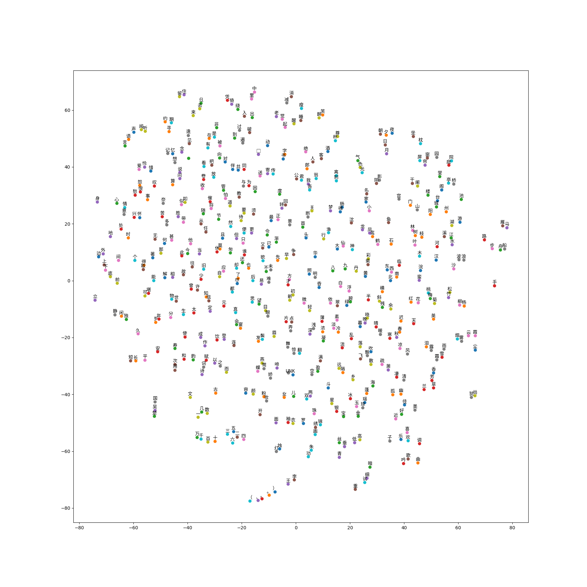

## 一、 word embedding部分

### 1.代码文件如下：

word2vec_week11.py

### 2.输出的图片结果:



图中能看到很多距离较近的字。

### 3.代码中处理matplotlib 中文显示异常

使用了如下的方法：

```python
from pylab import mpl
# 修改ubuntu字体用来兼容中文显示
zhfont = mpl.font_manager.FontProperties(fname='/usr/share/fonts/opentype/noto/NotoSansCJK-Regular.ttc')
```

下面调用pyplot的时候，加上参数 fontproperties=zhfont；就能解决中文显示方框的问题。

### 4.理解

embedding 就是将自然语言间的联系用数学向量表示在空间坐标中。方便了计算机的识别和操作。word2vec是一种embedding算法，使用稠密的表达方式，对one_hot降维，得到低维实数向量，将特征向量映射到多维空间，不仅仅是坐标轴上，避免产生维度爆炸。


## 二、RNN部分

### 1.运行情况：

模型地址：https://www.tinymind.com/code-wxy/week11

模型运行结果：https://www.tinymind.com/executions/nfmn3yq1

log文件：

```tex
2018-08-07 06:31:01.934898: I tensorflow/core/platform/cpu_feature_guard.cc:140] Your CPU supports instructions that this TensorFlow binary was not compiled to use: SSE4.1 SSE4.2 AVX AVX2 FMA
2018-08-07 06:31:02.009988: I tensorflow/stream_executor/cuda/cuda_gpu_executor.cc:898] successful NUMA node read from SysFS had negative value (-1), but there must be at least one NUMA node, so returning NUMA node zero
2018-08-07 06:31:02.010376: I tensorflow/core/common_runtime/gpu/gpu_device.cc:1212] Found device 0 with properties: 
name: Tesla K80 major: 3 minor: 7 memoryClockRate(GHz): 0.8235
pciBusID: 0000:00:04.0
totalMemory: 11.17GiB freeMemory: 11.09GiB
2018-08-07 06:31:02.010429: I tensorflow/core/common_runtime/gpu/gpu_device.cc:1312] Adding visible gpu devices: 0
2018-08-07 06:31:02.283508: I tensorflow/core/common_runtime/gpu/gpu_device.cc:993] Creating TensorFlow device (/job:localhost/replica:0/task:0/device:GPU:0 with 10751 MB memory) -> physical GPU (device: 0, name: Tesla K80, pci bus id: 0000:00:04.0, compute capability: 3.7)
2018-08-07 06:31:02,735 - DEBUG - sample.py:41 - Initialized
INFO:tensorflow:Restoring parameters from /output/model.ckpt-29700
2018-08-07 06:31:02,741 - INFO - tf_logging.py:116 - Restoring parameters from /output/model.ckpt-29700
2018-08-07 06:31:02,767 - DEBUG - sample.py:46 - restore from [/output/model.ckpt-29700]
2018-08-07 06:31:03,203 - DEBUG - sample.py:81 - ==============[江神子]==============
2018-08-07 06:31:03,203 - DEBUG - sample.py:82 - 江神子一年人，一里春风。


刘UNK

水调歌头（寿韵）

一里风风，一里一番，一番风雨。一里风花，一番一里，一片春风。

一年一
```


### 2.理解

循环神经网络，我的理解就是相较于全连接及卷积神经网络的区别是增加了时间的维度。在一段时间内的数据作为数据集里，每一步的权重计算时都要将之前一步的权重参与计算。在反向传播中，也同样将后一个权重的因子参与到前一个权重的计算中来更新前一个权重，将所有权重串起来，从而达到权重W在时间维度上的体现。

### 3.心得体会

本次作业有点拖沓，想比较前面的作业，感觉这个作业结构稍微复杂一点，开始有点蒙，慢慢理了一遍。至于写诗机器人，代码中我使用了word embeding作业中生成的embeding_file.npy ，最后的写诗的效果不是很好,注意到出现了很多空格，由于没有进行文字的处理，导致空格很多不是很美观，写出的诗还算过得去，哈哈，作业的基本是完成了，没有进行优化。

